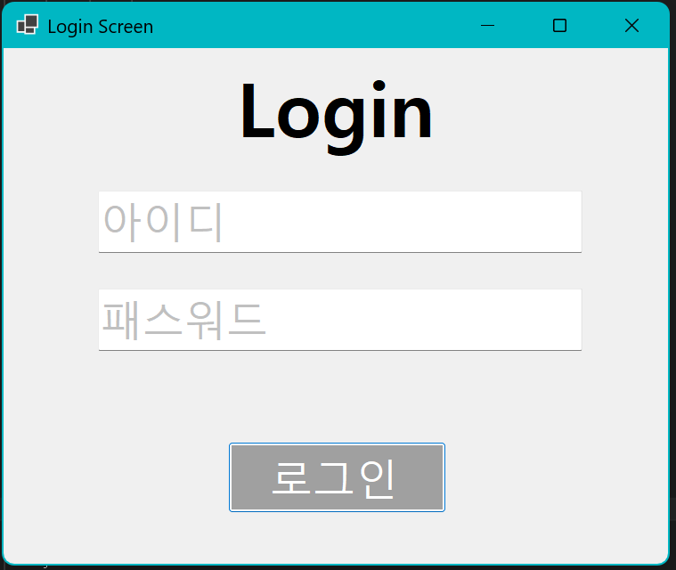
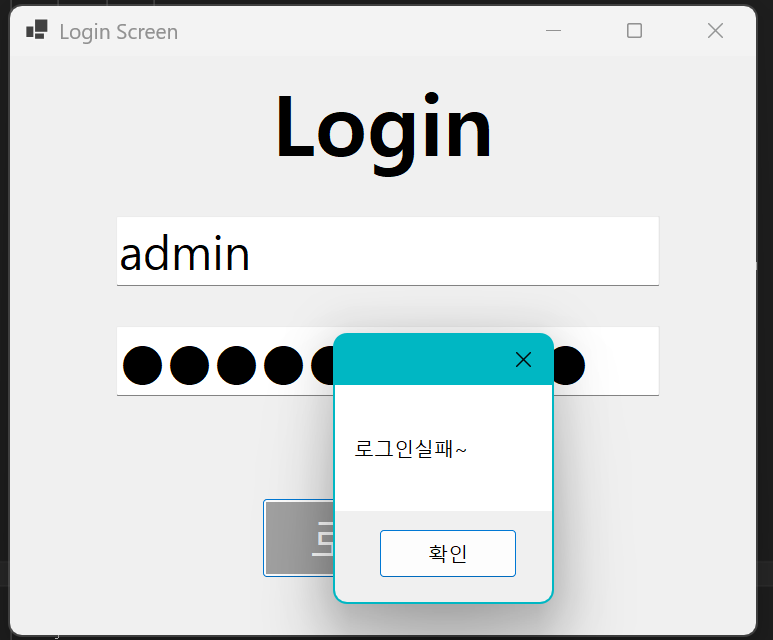
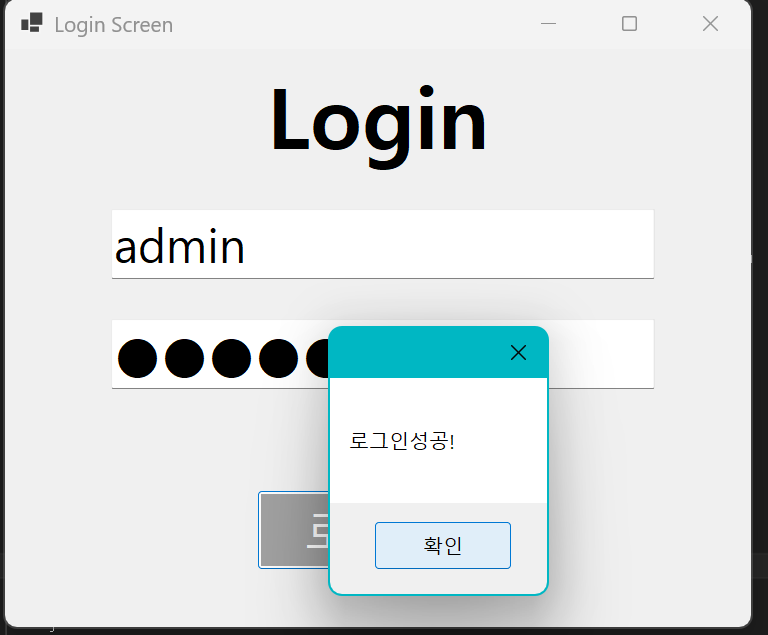

# (C# 코딩) 로그인 화면

## 개요
- C# 프로그래밍학습
- 1줄소개: 아이디와 패스워드를 입력해야 하는 로그인 화면
- 사용한플랫폼: 
	- C#, .NET Windows Forms, Visual Studio, GitHub
- 사용한컨트롤:
	-TextBox, Button, Label
- 사용한기술과구현한기능:
	- Visual Studio를이용하여UI 디자인
	- 논리 연산자 사용으로 로그인 성공 여부 확인
	- Placeholder 기능 구현
	- 탭을 이용한 입력 포커스 제어

## 실행화면(과제1)
-과제1코드의실행스크린샷

- 과제내용
	- Label(표시), Textbox(입력), Button(전송)을 정확히 배치
	- TextBox에 Placeholder 기능 구현
	- 아이디와 패스워드 처리 기능 구현
- 구현내용과기능설명
	- UI 구성 (TextBox(아이디, 페스워드), Button(로그인) 배치)
	- Placeholder 기능 구현 (아이디와 페스워드 입력 힌트 표시)
	- 로그인 기능 구현 (아이디와 페스워드 모두 일치시 로그인 성공 출력/ 둘중 하나라도 틀릴시 로그인 실패 출력)
